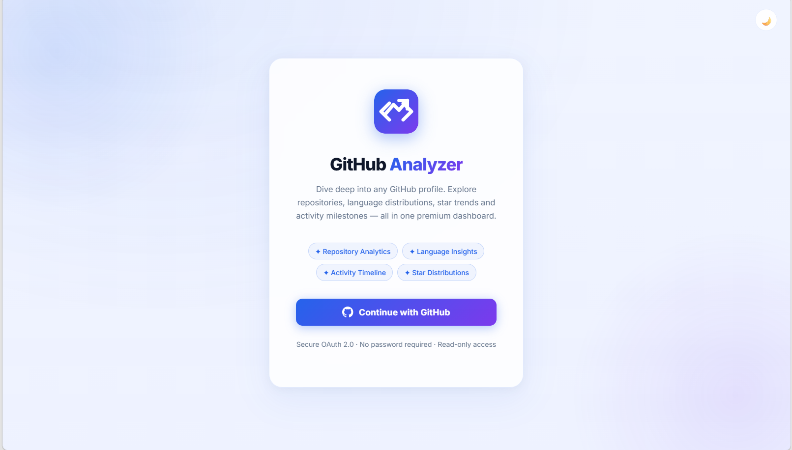
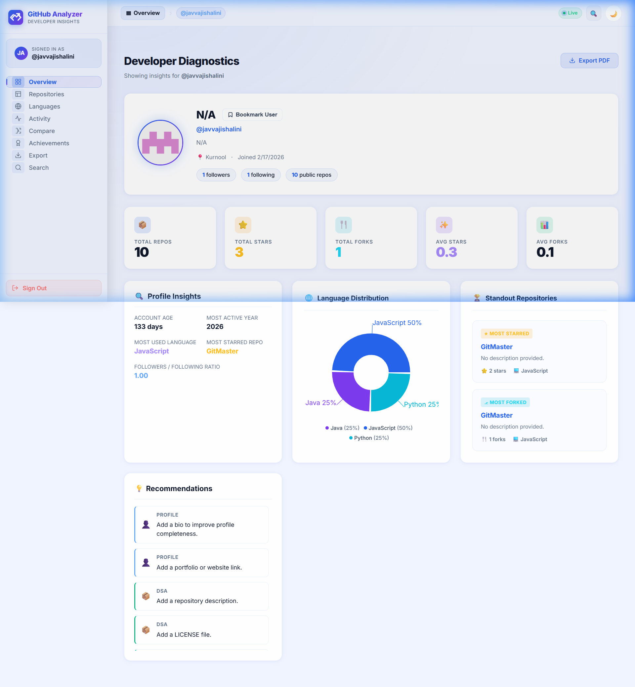
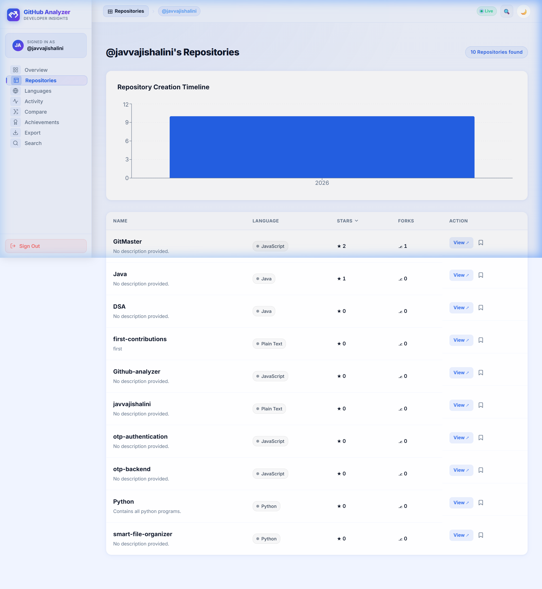
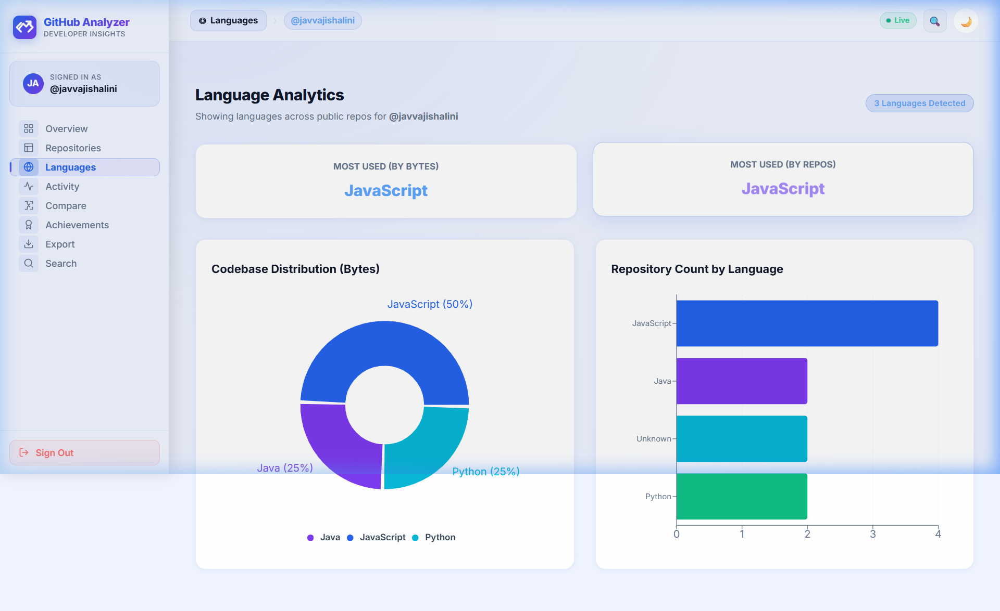
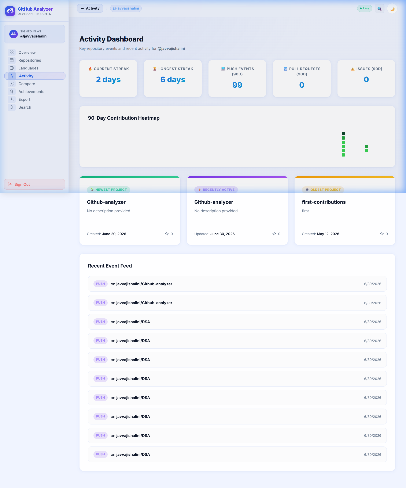
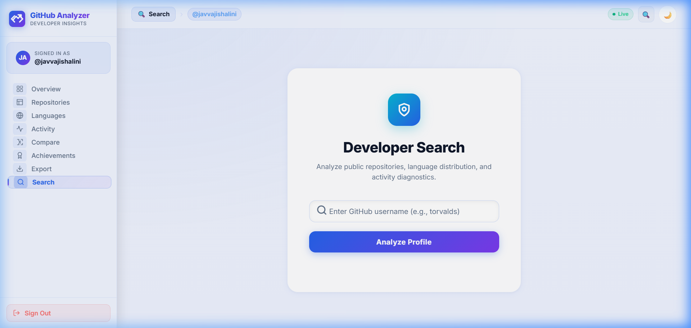
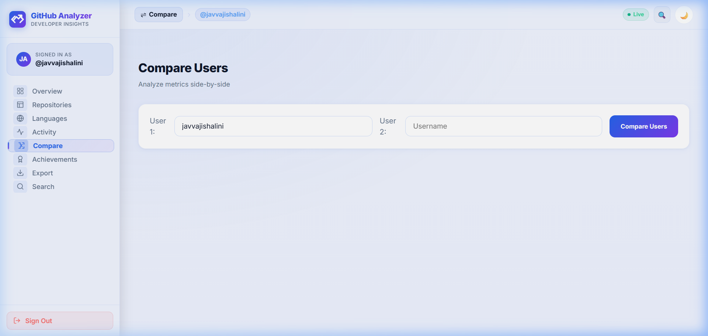
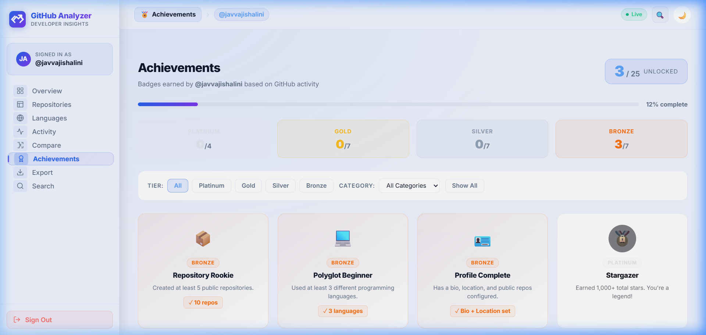
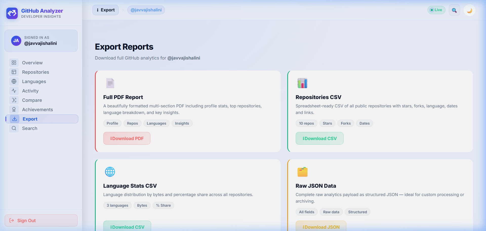
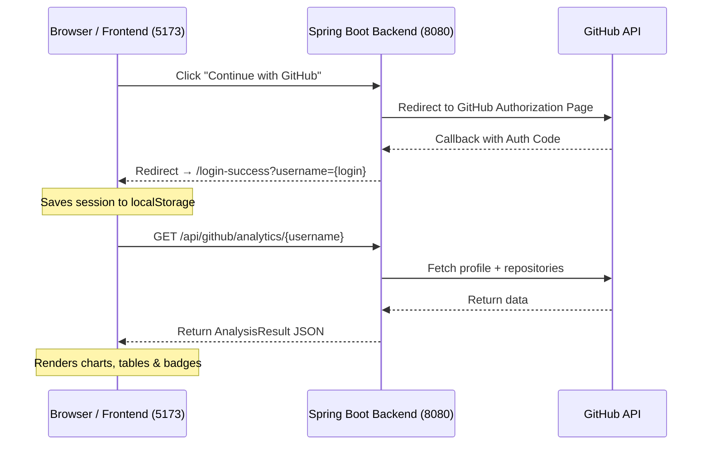

# 📊 GitHub Analyzer

> A premium, full-stack developer analytics dashboard for GitHub profiles — built with **Spring Boot** and **React + Vite**.

GitHub Analyzer lets you sign in with your GitHub account and instantly explore deep insights about any public GitHub profile: repository breakdowns, language distributions, activity timelines, developer achievements, profile comparisons, and PDF report exports — all in one beautiful, glassmorphic dashboard.

---

## 🖼️ Screenshots

| Login / Home | Overview |
|:---:|:---:|
|  |  |

| Repositories | Languages |
|:---:|:---:|
|  |  |

| Activity | Search |
|:---:|:---:|
|  |  |

| Compare | Achievements |
|:---:|:---:|
|  |  |

| Export |
|:---:|
|  |

---

## ✨ Features

| Feature | Description |
|---------|-------------|
| 🔒 **GitHub OAuth2 Login** | Secure, one-click sign in using GitHub OAuth — no passwords needed |
| 📊 **Developer Overview** | Profile stats, total repos/stars/forks, language pie chart, top repos, and smart recommendations |
| 🗂️ **Repository Browser** | Sortable, filterable, paginated grid of all public repositories |
| 🌐 **Language Analytics** | Breakdown of programming languages across all repositories with interactive charts |
| 📅 **Activity Timeline** | Visual commit history and GitHub event activity feed |
| 🔍 **Profile Search** | Search and instantly preview any public GitHub user's stats |
| ⚖️ **Profile Comparison** | Side-by-side comparison of two GitHub developer profiles |
| 🏆 **Achievements** | Gamified badge system (Bronze, Silver, Gold, Platinum) based on GitHub activity milestones |
| 📄 **PDF Export** | Download a beautifully-rendered developer summary report as a PDF |
| 🌓 **Dark / Light Mode** | Seamless theme toggle with glassmorphic design |

---

## ⚙️ How It Works

The application is a decoupled client-server system communicating via REST, with the Vite dev server proxying `/api` calls to the Spring Boot backend.



### Authentication Flow
1. User clicks **Continue with GitHub** on the login page.
2. Browser redirects to `http://localhost:8080/oauth2/authorization/github`.
3. GitHub redirects back to the backend callback `/login/oauth2/code/github` with an auth code.
4. The backend exchanges the code for a token; `OAuth2LoginSuccessHandler` redirects to `http://localhost:5173/login-success?username={login}`.
5. The frontend saves the session to `localStorage` and routes to the Overview dashboard.

### Data Flow
1. The frontend calls `/api/github/analytics/{username}` (proxied to backend via Vite).
2. The backend's `GitHubService` fetches user metadata and paginates through all public repositories.
3. It computes: total stars, forks, language counts, oldest/newest repos, and top repos.
4. A `SuggestionService` generates rule-based profile improvement recommendations.
5. Results are packaged as an `AnalysisResult` JSON payload and returned to the frontend.
6. Language counts feed a Recharts SVG pie chart; repositories go into a sortable/filterable table; the Export page uses `html2canvas` + `jsPDF` to generate a downloadable PDF.

---

## 📂 Project Structure

```text
Github-analyzer/
├── backend/
│   ├── src/main/java/com/githubanalyzer/backend/
│   │   ├── config/          # Spring Security and OAuth2 configurations
│   │   ├── controller/      # REST API controllers
│   │   ├── dto/             # Data transfer objects
│   │   ├── model/           # Domain schemas
│   │   ├── service/         # GitHub API & suggestion logic
│   │   └── BackendApplication.java
│   └── pom.xml
│
├── frontend/
│   ├── src/
│   │   ├── components/      # Sidebar, Header, Logo, DarkModeToggle
│   │   ├── pages/           # Overview, Repositories, Languages, Activity,
│   │   │                    # Search, Compare, Achievements, Export
│   │   ├── App.jsx          # Router, auth guard & login page
│   │   ├── App.css          # Theme variables & glassmorphic styles
│   │   └── main.jsx
│   ├── package.json
│   └── vite.config.js       # Vite config with /api proxy
│
├── screenshots/             # App screenshots for this README
├── start_backend.bat        # One-click backend launcher (Windows)
├── run_maven_build.bat      # Maven build helper
└── set_token.bat            # Helper to create .env credentials file
```

---

## 🛠️ Prerequisites

| Tool | Version | Download |
|------|---------|----------|
| Java JDK | 17 or newer | [adoptium.net](https://adoptium.net) |
| Node.js | 18.0.0 or newer | [nodejs.org](https://nodejs.org) |

---

## ⚙️ Setup

### 1. Register a GitHub OAuth App

1. Go to **GitHub → Settings → Developer Settings → OAuth Apps → New OAuth App**
2. Fill in:
   - **Homepage URL:** `http://localhost:5173`
   - **Authorization callback URL:** `http://localhost:8080/login/oauth2/code/github`
3. Copy your **Client ID** and **Client Secret**

### 2. Configure Credentials

Open `backend/src/main/resources/application.properties` and set:

```properties
spring.security.oauth2.client.registration.github.client-id=YOUR_CLIENT_ID
spring.security.oauth2.client.registration.github.client-secret=YOUR_CLIENT_SECRET
```

> **Tip:** Run `set_token.bat` to create a `.env` file with your credentials instead.

---

## 🚀 How to Run

Open **two terminals** simultaneously.

### Terminal 1 — Backend (Port 8080)

```powershell
.\start_backend.bat
```

This automatically: frees port 8080, loads credentials from `.env`, builds the JAR (first run only), and starts the server.

✅ Ready when you see: `Started BackendApplication in X.XXX seconds`

### Terminal 2 — Frontend (Port 5173)

```powershell
cd frontend
npm install     # first run only
npm run dev
```

✅ Ready when you see: `Local: http://localhost:5173/`

### Open the App

```
http://localhost:5173
```

Click **"Continue with GitHub"** to sign in and start exploring! 🎉

---

## 💻 Tech Stack

### Backend
| Technology | Purpose |
|-----------|---------|
| Java 17 | Core language |
| Spring Boot 3.2 | Web framework |
| Spring Security | Authentication & authorization |
| Spring OAuth2 Client | GitHub OAuth2 integration |
| Gson | JSON serialization |

### Frontend
| Technology | Purpose |
|-----------|---------|
| React 19 | UI framework |
| Vite 8 | Build tool & dev server with API proxy |
| React Router 7 | Client-side routing |
| Recharts 3 | Interactive SVG charts |
| jsPDF + html2canvas | PDF report generation |
| Vanilla CSS | Theming with CSS custom properties |

---

## 🤝 Contributing

Pull requests are welcome! Please open an issue first for major changes.
