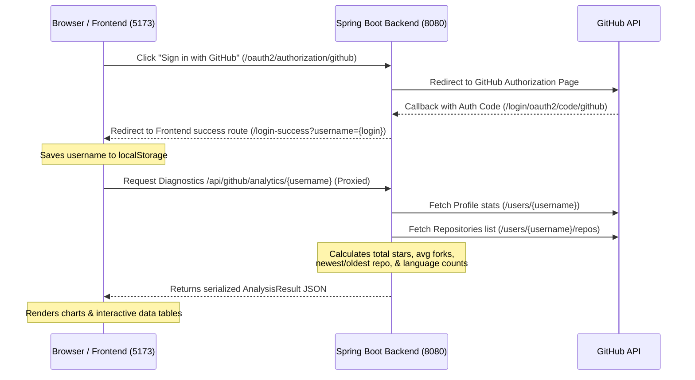

# 📊 GitHub User Analyzer

A premium, full-stack diagnostics and analytics dashboard for GitHub profiles. Built with a high-performance **Spring Boot** API gateway and a responsive, glassmorphic **React + Vite** single-page routed frontend.

---

## ✨ Features

*   **🔒 Secure GitHub Sign-In:** Authenticate seamlessly using GitHub OAuth2 protocols.
*   **💡 Smart Developer Suggestions:** Rule-based recommendation engine offering actionable profile, repository, and activity heuristics.
*   **📈 Visual Analytics:** Render language distributions (custom Recharts Pie charts) and repository metrics.
*   **🌱 Developer Milestones:** Easily view oldest, newest, and recently updated project metadata.
*   **📋 Interactive Repository Grid:** Filter, sort (by name, language, stars, and forks), and paginate repository listings.
*   **📄 PDF Report Export:** Save a beautifully-rendered developer summary report as a PDF using `jsPDF` and `html2canvas`.
*   **☀️ Dynamic Theme Swapper:** Toggle between a futuristic dark slate mode and a clean, high-contrast light mode.

---

## ⚙️ How It Works (Architecture & Data Flow)

The application operates as a decoupled client-server system communicating over REST endpoints with Vite proxy forwarding.



### 1. The OAuth2 Authentication Pipeline
1. The user visits the frontend dashboard at `http://localhost:5173/` and clicks **Sign in with GitHub**.
2. The browser is directed to `http://localhost:8080/oauth2/authorization/github`, triggering Spring Security’s OAuth2 workflow.
3. Upon authorization on GitHub's secure page, GitHub redirects back to the backend callback (`/login/oauth2/code/github`) with an authorization code.
4. The backend exchanges the code for an access token, instantiates an authentication context, and handles success via the `OAuth2LoginSuccessHandler`.
5. The handler redirects the user back to the React app: `http://localhost:5173/login-success?username={login}`.
6. The frontend captures the username parameter, saves the active session context in `localStorage`, and routes the client to the Overview diagnostics view.

### 2. The Diagnostics & Analytics Engine
1. When loading statistics for a developer, the frontend calls the relative path `/api/github/analytics/{username}`.
2. The local Vite dev server proxies `/api` requests same-origin to the Spring Boot backend (`http://localhost:8080/api`), preventing CORS blockages.
3. The backend’s `GitHubService` performs asynchronous network calls to GitHub's REST API (`https://api.github.com/users/{username}`) to grab user metadata, and recursively paginates through `/users/{username}/repos` to fetch all public repositories.
4. The backend filters out fork details, sums up stargazers and forks counts, compares creation dates to determine oldest/newest projects, sorts repositories by stars to find top repositories, and maps programming language distribution counts.
5. A dedicated `SuggestionService` evaluates the data and generates rule-based recommendations for improving profile completeness, repository documentation, and activity engagement.
6. The computed metrics are packaged into an `AnalysisResult` data structure and returned as a JSON payload, while suggestions are fetched via a dedicated endpoint.

### 3. Data Representation & Reporting
1. The frontend parses the `AnalysisResult` and feeds the language count array to a responsive `Recharts` SVG pie chart.
2. Repositories are mapped into a client-side sorted, filtered, and paginated custom HTML table.
3. When the user selects **Export PDF Report**, the `html2canvas` parser grabs the DOM layout container, constructs a canvas image frame, and pushes it into a structured high-resolution vector PDF using `jsPDF` for downloads.

---

## 📂 Project Structure

```text
GitHub Analyzer/
├── backend/
│   ├── src/main/java/com/githubanalyzer/backend/
│   │   ├── config/          # Spring Security and OAuth2 configurations
│   │   ├── controller/      # REST API controllers (GitHub statistics)
│   │   ├── dto/             # API data transfer objects
│   │   ├── exception/       # Global HTTP exception handlers
│   │   ├── model/           # Diagnostic schemas
│   │   └── BackendApplication.java
│   └── pom.xml              # Maven dependencies & build configurations
│
└── frontend/
    ├── src/
    │   ├── components/      # Global Layout UI (Sidebar, Header, Theme Toggle)
    │   ├── pages/           # Pages (Overview, Repositories, Languages, Activity, Search)
    │   ├── App.jsx          # Main Router, protected session guard, & login screen
    │   ├── App.css          # Theme variables & glassmorphic layouts
    │   └── main.jsx         # App mounting point
    ├── package.json         # Node.js dependencies
    └── vite.config.js       # Vite configuration with local API proxy
```

---

## 🛠️ Prerequisites

Before running the application, make sure you have:
*   **Java Development Kit (JDK) 17** (or newer)
*   **Node.js** (v18.0.0 or newer)
*   An active internet connection (to retrieve diagnostic data from GitHub's REST API)

---

## ⚙️ Configuration & Setup

### 1. Register GitHub OAuth App
To enable the **Sign in with GitHub** functionality, register an OAuth application on GitHub:
1. Go to **Settings > Developer Settings > OAuth Apps > Register a new application**.
2. Set the **Homepage URL** to: `http://localhost:5173/`
3. Set the **Authorization callback URL** to: `http://localhost:8080/login/oauth2/code/github`
4. Copy the generated **Client ID** and **Client Secret**.

### 2. Configure Backend Credentials
Open [backend/src/main/resources/application.properties](file:///c:/Users/Shalini/OneDrive/Desktop/GitHub%20Analyzer/backend/src/main/resources/application.properties) and update the credentials:
```properties
spring.security.oauth2.client.registration.github.client-id=YOUR_CLIENT_ID
spring.security.oauth2.client.registration.github.client-secret=YOUR_CLIENT_SECRET
```

---

## 🚀 How to Run

To run the application locally, you must keep **two terminal windows** open:

### Step 1: Start the Backend (Port 8080)
Open a terminal in the root directory and build/launch the Spring Boot service:
```powershell
# Build the JAR package
.\run_maven_build.bat

# Start the server
java -jar backend/target/backend-1.0.0.jar
```
*Verify that the log shows `Started BackendApplication in X.XXX seconds` on port `8080`.*

### Step 2: Start the Frontend (Port 5173)
Open a second terminal, navigate into the `frontend` folder, and launch Vite:
```powershell
cd frontend
npm install
npm run dev
```
*Open `http://localhost:5173` in your browser to launch the dashboard.*

---

## 💻 Tech Stack
*   **Backend:** Java 17, Spring Boot, Spring Security (OAuth2 Client), Gson
*   **Frontend:** React 19, Vite, React Router 7, Recharts 3, jsPDF, html2canvas
*   **Theme Engine:** Vanilla CSS custom variables (supporting seamless dark/light modes)
